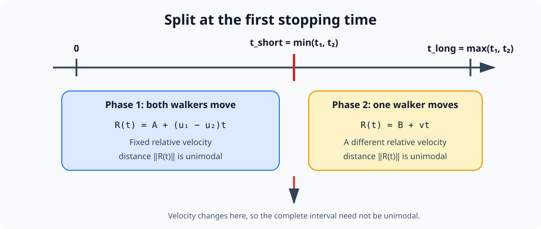

# E - Closest Moment

[Problem link](https://atcoder.jp/contests/abc426/tasks/abc426_e)

**Contest:** [AtCoder Beginner Contest 426](https://atcoder.jp/contests/abc426)

time limit: 3 sec

memory limit: 1024 MiB

score: 450 points

## Problem

Takahashi and Aoki walk on a 2D plane.

- Takahashi: start `(TS_X, TS_Y)`, goal `(TG_X, TG_Y)`
- Aoki: start `(AS_X, AS_Y)`, goal `(AG_X, AG_Y)`

They start at the same time, walk straight toward their goals at speed `1`, and stop
upon reaching the goal (stop times may differ).

Find the Euclidean distance between them at the moment when that distance is
shortest (including departure and after both have stopped).

There are `T` test cases; solve each.

## Constraints

- `1 <= T <= 2 * 10^5`
- `-100 <= TS_X, TS_Y, TG_X, TG_Y, AS_X, AS_Y, AG_X, AG_Y <= 100`
- `(TS_X, TS_Y) != (TG_X, TG_Y)`
- `(AS_X, AS_Y) != (AG_X, AG_Y)`
- All input values are integers

## Input

```text
T
case_1
...
case_T
```

Each test case:

```text
TS_X TS_Y TG_X TG_Y
AS_X AS_Y AG_X AG_Y
```

## Output

Print `T` lines. The `i`-th line is the answer for the `i`-th test case.

Absolute or relative error at most `1e-6` is accepted.

## Sample 1

```text
Input
4
0 0 -2 2
-1 -1 4 4
4 0 2 0
6 0 8 0
1 0 1 1
-1 0 1 1
-8 9 2 6
-10 -10 17 20

Output
1.000000000000000
2.000000000000000
0.000000000000000
1.783905950993199
```

## Solution Summary

### Position at time `t`

Consider a walker whose start and goal are:

```text
S = (x0, y0)
G = (x1, y1)
```

Let:

```text
dx = x1 - x0
dy = y1 - y0
D  = hypot(dx, dy)
```

Because the speed is `1`, the walker needs exactly `D` units of time to reach
the goal. At time `t`, the fraction of the segment already traveled is:

```text
ratio = min(t / D, 1)
```

Therefore, the position is:

```text
x(t) = x0 + dx * ratio
y(t) = y0 + dy * ratio
```

Using the vector `(dx, dy)` directly is important: it preserves the signs of
both components and works for motion in every direction. Once `t >= D`,
`ratio = 1`, so the position remains at the goal.

### Relative position and distance

Let `P_T(t)` and `P_A(t)` be Takahashi's and Aoki's positions. Their relative
position is:

```text
R(t) = P_T(t) - P_A(t)
```

and the required value is the minimum of:

```text
distance(t) = |R(t)|
```

Only the interval from time `0` until the later arrival time matters. After
both walkers reach their goals, neither position changes, so the distance is
constant.

### Why the search must have two phases

Let:

```text
t1 = Takahashi's travel time
t2 = Aoki's travel time
t_short = min(t1, t2)
t_long  = max(t1, t2)
```



The motion has two different phases.

#### Phase 1: both walkers are moving

For:

```text
0 <= t <= t_short
```

both walkers have constant velocity vectors, say `u1` and `u2`. Hence:

```text
R(t) = (startT - startA) + (u1 - u2) * t
```

This has the form:

```text
R(t) = A + B*t
```

Its squared length is:

```text
|R(t)|²
= |A + B*t|²
= (B·B)t² + 2(A·B)t + A·A
```

The coefficient of `t²` is `B·B >= 0`, so this is a convex quadratic.
Consequently, the distance is unimodal on this phase and ternary search is
valid.

#### Phase 2: one walker has stopped

For:

```text
t_short <= t <= t_long
```

the first walker to arrive stays at the goal, while the other continues with a
constant velocity. The relative position again has the form:

```text
R(t) = C + V*t
```

so its squared length is another convex quadratic. The distance is also
unimodal on this second phase.

#### Why one global ternary search is wrong

At `t_short`, one walker stops. The relative velocity changes abruptly:

```text
u1 - u2  ->  -u2
```

or:

```text
u1 - u2  ->  u1
```

Although the distance is unimodal inside each phase, joining two different
convex pieces does not guarantee that the complete function is unimodal. One
phase may have a local minimum near its left endpoint while the other phase has
a smaller minimum later.

Therefore, perform two independent ternary searches:

```text
answer1 = ternary(0, t_short)
answer2 = ternary(t_short, t_long)
answer  = min(answer1, answer2)
```

If `t1 == t2`, the second interval has length zero. It simply evaluates the
distance at their common arrival time and causes no special-case problem.

### Ternary search

Inside one phase `[left, right]`, choose:

```text
m1 = left  + (right - left) / 3
m2 = right - (right - left) / 3
```

Compare `distance(m1)` and `distance(m2)`:

- if `distance(m1) < distance(m2)`, discard `[m2, right]`;
- otherwise, discard `[left, m1]`.

Each iteration keeps the part that contains the minimum. Repeating this a
fixed number of times makes the remaining interval far smaller than the
required `1e-6` precision.

The implementation stores the smallest sampled value during each search and
returns the smaller result from the two phases.

### Correctness

1. `getPosAtTime` returns each walker's exact position: uniform motion before
   arrival and the fixed goal position afterward.
2. The interval `[0, t_short]` contains every moment when both walkers move.
   Its distance function is unimodal, so the first ternary search finds its
   minimum.
3. The interval `[t_short, t_long]` contains every moment when exactly one
   walker moves. Its distance function is unimodal, so the second ternary
   search finds its minimum.
4. After `t_long`, both walkers have stopped and their distance is unchanged
   from its value at `t_long`.

Thus every relevant time belongs to one of the two searched phases, and taking
the smaller phase minimum gives the global minimum distance.

### Complexity

Let `K` be the fixed number of ternary-search iterations (`100` in the code).
Each distance evaluation takes `O(1)`, so:

```text
Time:  O(K) per test case
Space: O(1)
```

Since `K` is a constant, this is `O(1)` time per test case asymptotically.
