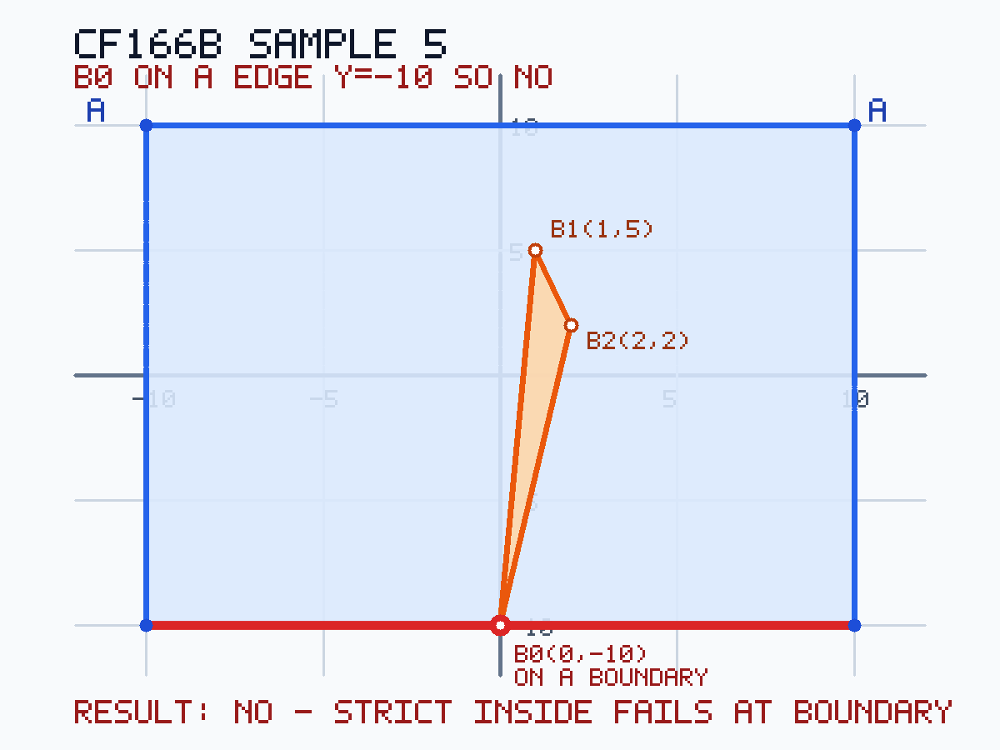

# B. Polygon

[Problem link](https://codeforces.com/problemset/problem/166/B)

**Contest:** [Codeforces Round #115 (Div. 2)](https://codeforces.com/contest/166)

time limit per test: 2 seconds

memory limit per test: 256 megabytes

input: standard input

output: standard output

You are given two polygons as vertex lists.

- Polygon **A** is strictly convex.
- Polygon **B** is a simple polygon (no self-intersections or self-touches).

Both vertex lists are given in **clockwise** order. No three consecutive vertices of either polygon lie on
the same line.

Determine whether polygon **B** lies **strictly inside** polygon **A**: every point of `B` must be
strictly inside `A`. In particular, no vertex of `B` may lie on an edge of `A`.

## Input

The first line contains `n` (`3 <= n <= 10^5`) — the number of vertices of polygon `A`.

Each of the next `n` lines contains two integers `x_i, y_i` (`|x_i|, |y_i| <= 10^9`).

The next line contains `m` (`3 <= m <= 2 * 10^4`) — the number of vertices of polygon `B`.

Each of the next `m` lines contains two integers `x_j, y_j` (`|x_j|, |y_j| <= 10^9`).

## Output

Print `YES` if polygon `B` is strictly inside polygon `A`, otherwise print `NO`.

## Example

### Input

```text
6
-2 1
0 3
3 3
4 1
3 -2
2 -2
4
0 1
2 2
3 1
1 0
```

### Output

```text
YES
```

### Input

```text
5
1 2
4 2
3 -3
-2 -2
-2 1
4
0 1
1 2
4 1
2 -1
```

### Output

```text
NO
```

### Input

```text
5
-1 2
2 3
4 1
3 -2
0 -3
5
1 0
1 1
3 1
5 -1
2 -1
```

### Output

```text
NO
```

## Solution

The implementation turns the strict containment test into two convex hull checks.

First build two point sets:

1. `arr1`: only the vertices of polygon `A`.
2. `arr2`: all vertices of `A` plus all vertices of `B`.

Let `first = convex_hull(arr1)` and `second = convex_hull(arr2)`. The hull routine keeps collinear
points on the hull boundary: when three points are collinear, it does not remove the middle point.

If any vertex of `B` is outside `A`, adding it to `arr2` changes the outer convex hull. Then `second`
has a different length or a different vertex sequence from `first`, so the answer is `NO`.

If every vertex of `B` is inside or on the boundary of `A`, the outer hull cannot expand. However,
the problem requires strict containment, so a vertex of `B` on an edge of `A` must also be rejected.
Keeping collinear hull points catches many such cases because a boundary point from `B` becomes an
extra hull vertex in `second`.

The code also explicitly checks boundary collinearity against the final hull of `A`:

1. Split `first` into two x-monotone chains, `upper` and `lower`.
2. For each vertex of `B`, binary search the segment of each chain whose x-range contains that point.
3. If the point is collinear with either matching chain segment, it lies on the boundary of `A`, so the
   answer is `NO`.

After these checks, all vertices of `B` are strictly inside convex polygon `A`. Because `A` is convex,
every segment between two vertices of `B` is also inside `A`; therefore the whole polygon `B` is
strictly inside `A`.

### Correctness

If the algorithm returns `YES`, the hull of `A ∪ B` is exactly the same as the hull of `A`, so no
vertex of `B` is outside `A`. The chain collinearity check also proves that no vertex of `B` lies on
an edge of `A`. Thus every vertex of `B` is strictly inside `A`. Since `A` is convex, all edges and
interior points of polygon `B` are strictly inside `A`, so the required condition holds.

If polygon `B` is strictly inside polygon `A`, adding vertices of `B` cannot change the convex hull of
`A`; all those points are interior points. Also, no vertex of `B` is collinear with a boundary segment
of `A` in a way that places it on the segment. Therefore the hull comparison succeeds, the boundary
checks succeed, and the algorithm returns `YES`.

So the algorithm returns `YES` exactly when polygon `B` lies strictly inside polygon `A`.

### Complexity

Let `n = |A|` and `m = |B|`.

The two convex hull computations sort `n` and `n + m` points, so the total time complexity is
`O((n + m) log(n + m))`. The boundary checks binary-search the two hull chains for each vertex of
`B`, adding `O(m log n)`.

The memory complexity is `O(n + m)`.

### Sample 5 boundary case



In sample 5, vertex `B0 = (0, -10)` lies on the bottom edge of polygon `A`, so containment is not
strict and the answer is `NO`.
