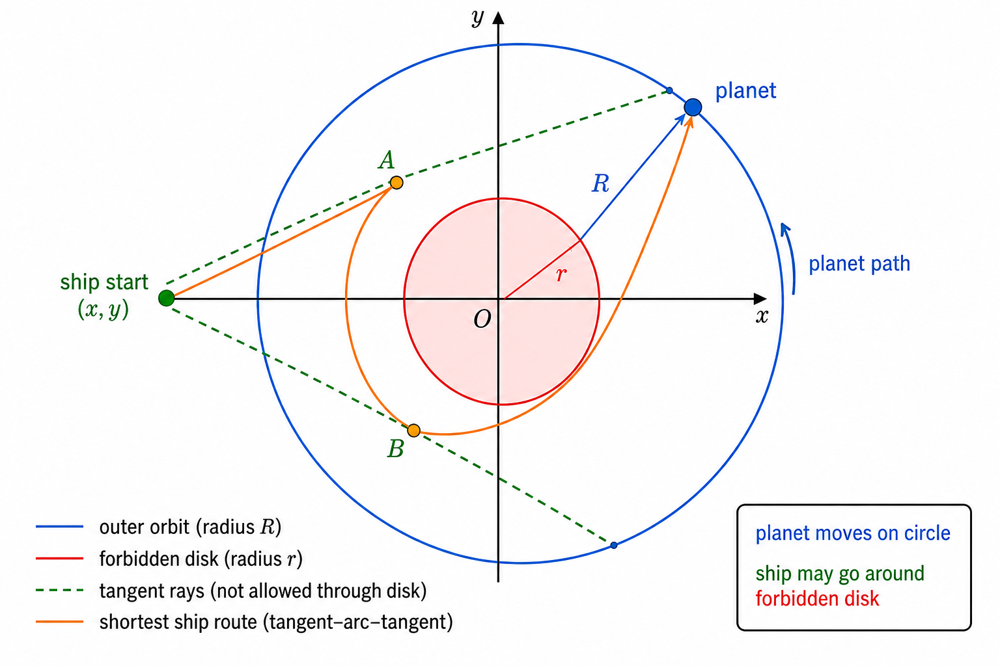

# C. Delivering Carcinogen

[Problem link](https://codeforces.com/problemset/problem/198/C)

**Contest:** [Codeforces Round #125 (Div. 1)](https://codeforces.com/contest/198)

time limit per test: 2 seconds

memory limit per test: 256 megabytes

input: standard input

output: standard output

Qwerty the Ranger arrived to the Diatar system with a very important task. He should deliver a
special carcinogen for scientific research to planet Persephone. This is urgent, so Qwerty has to
get to the planet as soon as possible.

Consider Qwerty's ship, planet Persephone, and star Diatar as points on a plane. Diatar is at the
origin `(0, 0)`. Persephone moves counter-clockwise along a circular orbit of radius `R` at constant
linear speed `v_p`, where `R = sqrt(x_p^2 + y_p^2)`. At time `0`, Persephone is at `(x_p, y_p)`.

At time `0`, Qwerty's ship is at `(x, y)`. The ship can move in any direction at speed at most `v`
(`v > v_p`). The star is too hot to approach: the ship cannot enter the disk of radius `r` centered
at the origin (`r < R`).

Find the minimum time needed for Qwerty to reach Persephone.

## Input

The first line contains three integers `x_p`, `y_p`, and `v_p`
(`-10^4 <= x_p, y_p <= 10^4`, `1 <= v_p < 10^4`).

The second line contains four integers `x`, `y`, `v`, and `r`
(`-10^4 <= x, y <= 10^4`, `1 < v <= 10^4`, `1 <= r <= 10^4`).

It is guaranteed that `r^2 < x^2 + y^2`, `r^2 < x_p^2 + y_p^2`, and `v_p < v`.

## Output

Print one real number — the minimum delivery time. Your answer is accepted if its absolute or
relative error does not exceed `10^-6`.

## Example

### Input

```text
10 0 1
-10 0 2 8
```

### Output

```text
9.584544103
```

### Input

```text
50 60 10
50 60 20 40
```

### Output

```text
0.000000000
```

### ideas
1. 空间站在一个轨道R上,运动; 且有一个内圈r, 是不能靠近的地方
2. 然后从(x, y)出发, 直线速度v, 在不靠近内圈的情况下, 最快遇到空间站
3. 答案肯定存在, 不管哪个方向, 当空间站运动到合适的位置, 总能够遇到. 
4. 假设经过时间t后, 空间站到达了位置(x0, y0), 且这个位置可以在不经过内圈r的情况下, 与(x, y)能够连接, 且这个线的长度 / v <= t0, 那么就可以作为一个答案. 
5. 但是, 这是一个范围. 
6. 可以根据(x, y), R, r的关系,找到在R上两个点(x1, y1), (x2, y2), 在这个区间内, (x, y)可以望到空间站(不一定赶得上)
7. 然后在这个区间内, 二分答案即可(经过t时刻后, 是否在这个区域内)
8. 可以这么搞. 但是几何计算, 貌似还挺麻烦的.
9. 问题是, 相遇的时间, 不是连续的. 而且, 空间站还可以转圈
10. 先算出从(x, y)到p1, p2; 然后二分t, 假设经过t个时刻后, 空间站正好在这个区间的某个位置(x0, y0)
11. 那么只需要计算 (x, y) 到 (x0, y0)的时间 <= t即可
12. 如果不在这个区间内, 假设存在一个时间t0 < t, 它在这个区间内, 比如 t0 = 到达p2的时刻
13. 如果t0时刻, 飞船能够追上空间站, 也是ok的.
14. 好像是可以的, 因为 v > vp, 假设最优答案是t0, 那么对于 t2 > t0, 空间站在t0后面每次到达t2的位置, 飞船始终可以先到达p2
15. 

## Solution

The planet does not move in a straight line. It always moves counter-clockwise on the big circle
with radius:

```text
R = sqrt(xp^2 + yp^2)
```

Its angular speed is:

```text
w = vp / R
```

If its initial angle is `a0 = atan2(yp, xp)`, then at time `t` its position is:

```text
(R * cos(a0 + w * t), R * sin(a0 + w * t))
```

The ship can move freely, but it cannot enter the red forbidden disk of radius `r`.



For a fixed target point on the planet orbit, the ship needs the shortest path from its start point
to that target while avoiding the inner circle.

There are two cases.

### 1. Direct segment is valid

If the segment from the ship to the target does not intersect the forbidden disk, the shortest path
is just the Euclidean distance.

The code checks this by computing the distance from the origin to the segment. If that distance is
at least `r`, the segment stays outside the disk.

### 2. Direct segment is blocked

Then the shortest path must touch the forbidden circle:

```text
ship -> tangent point on circle r -> arc along circle r -> tangent point -> target
```

For any outside point `P`, the two tangent points on the small circle can be computed directly. If
`d = |P|`, the tangent segment length is:

```text
sqrt(d^2 - r^2)
```

For the ship point and the target point, we compute their two tangent points on the small circle.
Then we try all four pairs and choose the smallest angular distance between the two tangent points.

So the blocked shortest path length is:

```text
sqrt(|ship|^2 - r^2) + sqrt(|target|^2 - r^2) + r * bestArcAngle
```

Here `|target| = R`, because the planet is always on the orbit.

The helper `tangentPoints` from the ideas is still useful for drawing the visible boundary on the
big orbit, but visibility alone is not enough for the final solution. The ship may optimally go
around the forbidden disk and meet the planet at a position that is not directly visible from the
start.

### Binary search on time

For a time `t`, compute the planet's position at exactly that time and compute:

```text
need = shortestPath(ship, planet(t)) / v
```

If:

```text
need <= t
```

then the ship can reach the planet by time `t`.

This check is monotone. The shortest-path distance to the moving planet can change no faster than
the planet's own speed `vp`, while the ship speed is `v` and `v > vp`. Therefore:

```text
shortestPath(planet(t)) / v - t
```

strictly decreases over time, so a standard binary search finds the first feasible time.

The implementation first doubles the upper bound until it is feasible, then performs 100 binary
search iterations for enough precision.

Complexity is constant:

```text
O(1)
```

because each check uses only a few geometry formulas, and the number of binary-search iterations is
fixed.
