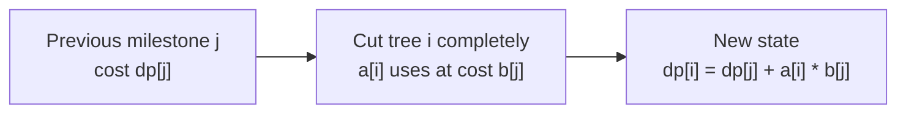
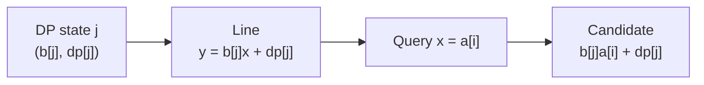
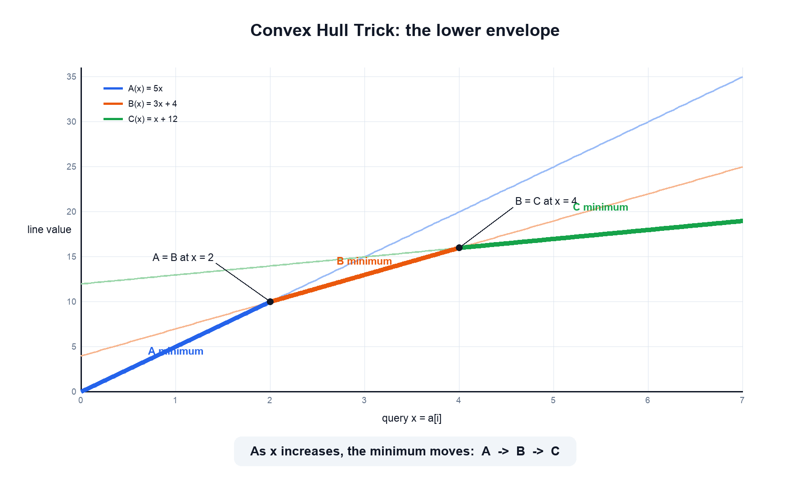
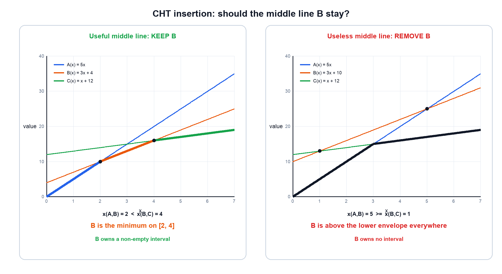
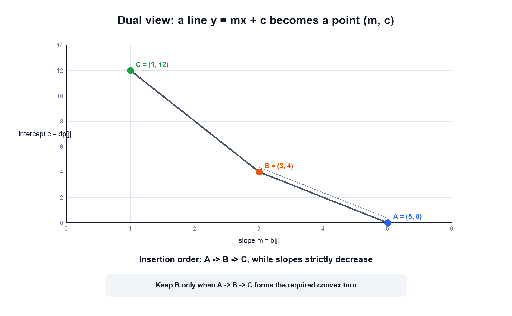

# C. Kalila and Dimna in the Logging Industry

[Problem link](https://codeforces.com/problemset/problem/319/C)

time limit per test: 2 seconds

memory limit per test: 256 megabytes

input: stdin

output: stdout

Kalila and Dimna are two jackals working in a logging factory. They must cut down
`n` trees with heights `a_1, a_2, ..., a_n`. Each use of the chain saw on tree `i`
decreases its height by one.

After each use, the chain saw must be recharged. The recharge cost depends on the
largest index of a tree that has been **completely cut** (height `0`):

- If the maximum such index is `i`, the recharge cost is `b_i`.
- If no tree is completely cut yet, recharging is impossible (the saw starts
  charged).

Given:

- `a_1 < a_2 < ... < a_n`
- `b_1 > b_2 > ... > b_n`
- `a_1 = 1`, `b_n = 0`

Find the minimum total cost to cut all trees completely.

## Input

The first line contains an integer `n` (`1 <= n <= 10^5`).

The second line contains `n` integers `a_1, a_2, ..., a_n` (`1 <= a_i <= 10^9`).

The third line contains `n` integers `b_1, b_2, ..., b_n` (`0 <= b_i <= 10^9`).

It is guaranteed that `a_1 = 1`, `b_n = 0`, `a_1 < a_2 < ... < a_n`, and
`b_1 > b_2 > ... > b_n`.

In C++, do not use `%lld` for 64-bit integers; prefer `cin`/`cout` or `%I64d`.

## Output

Print one integer — the minimum total cost to cut all trees completely.

## Examples

### Input

```text
5
1 2 3 4 5
5 4 3 2 0
```

### Output

```text
25
```

### Input

```text
6
1 2 3 10 20 30
6 5 4 3 2 0
```

### Output

```text
138
```

## ideas
1. 第一次,只能砍1号树, 这样子后续就可以至少使用b[1]来支付; 
2. 假设现在选择看i, 那么需要支付b[1] * a[i]的费用 (从而后续可以用b[i]来支付)
3. 假设依次处理, dp[i] = 把i砍掉的最优解
4. dp[i] = dp[j] + b[j] * a[i] (min)
5.  这个要用到凸优化 b[j]是斜率, dp[j]是y轴上的交点

## Solution Review

The implementation's DP recurrence and convex hull maintenance are correct. It
uses the two monotonicity guarantees from the statement:

- `b_1 > b_2 > ... > b_n`, so lines are inserted with strictly decreasing
  slopes;
- `a_1 < a_2 < ... < a_n`, so query x-coordinates are strictly increasing.

These properties allow a deque-based convex hull trick with amortized `O(1)`
insertion and query time.

One important numeric detail is the determinant comparison. A slope difference
can be about `10^9`, while a DP-value difference can be about `10^18`, so their
product can reach `10^27`. That does not fit in `int64`. The implementation uses
`math/big` in `detCmp` specifically to avoid this overflow. Ordinary line
evaluation is at most around `2 * 10^18`, which fits in signed 64-bit integers.

## Dynamic Programming

Consider the moments when a new largest-index tree becomes completely cut.

Suppose tree `j` is currently the largest-index completely cut tree. Recharging
the saw now costs `b_j` after every use. If tree `i`, where `j < i`, is chosen as
the next milestone, cutting all `a_i` units of tree `i` costs:

```text
a_i * b_j
```

Let `dp[i]` be the minimum cost when tree `i` has just become the largest-index
completely cut tree. Then:

```text
dp[i] = min(dp[j] + b[j] * a[i])   for 0 <= j < i
```

Tree `1` has height `1`, and the saw initially has one free charge, so:

```text
dp[0] = 0
```

After tree `n` is completely cut, every remaining cut can be recharged with
`b_n = 0`, so the final answer is `dp[n-1]`.



The direct DP checks every earlier `j` for every `i`, taking `O(n^2)` time.

## Turning DP States into Lines

For a fixed previous state `j`, rewrite its contribution as:

```text
dp[j] + b[j] * a[i]
```

Compare this with a line:

```text
y = m * x + c
```

The correspondence is:

```text
m = b[j]       slope
c = dp[j]      y-intercept
x = a[i]       query coordinate
```

Thus every completed DP state `j` inserts one line:

```text
line_j(x) = b[j] * x + dp[j]
```

and computing `dp[i]` means querying the minimum line value at `x = a[i]`:

```text
dp[i] = min_j line_j(a[i])
```



The code stores a line as the vector:

```go
vec{b[j], dp[j]}
```

and a query as:

```go
vec{a[i], 1}
```

Their dot product is exactly the line value:

```text
(b[j], dp[j]) dot (a[i], 1)
= b[j] * a[i] + dp[j]
```

## Visualizing the Lower Envelope

We do not need every inserted line forever. We only need lines that are the
minimum for at least one future x-coordinate. Together, those useful portions
form the lower envelope.

For example, consider these three lines:

```text
A(x) = 5x
B(x) = 3x + 4
C(x) =  x + 12
```

Their intersections are `x(A,B) = 2` and `x(B,C) = 4`. The minimum changes as
follows:

```text
x-range        minimum line
--------------------------------
x < 2          A, largest slope
2 <= x < 4     B
x >= 4         C, smallest slope
```



Because slopes are inserted in strictly decreasing order, a newer line is
flatter than every older line. Therefore, as x increases, the best line can only
move forward through the deque; it can never return to an earlier line.

## Querying the Hull

Let the first two deque lines be `L1` and `L2`. At the current query x, if:

```text
L1(x) >= L2(x)
```

then `L1` can be removed from the front.

Why is removal permanent? Since `L1` has a larger slope than `L2`, the
difference:

```text
L1(x) - L2(x)
```

only increases as x increases. Once `L2` is no worse, `L1` will never become
better at any future query.

```text
deque before query: [L1, L2, L3, ...]

if L1(x) >= L2(x):

deque after pop:    [L2, L3, ...]
                     ^
                     current best candidate
```

This is implemented by:

```go
for len(q) > 1 && q[0].dot(p) >= q[1].dot(p) {
    q = q[1:]
}
```

Every line is removed from the front at most once, so all queries together take
`O(n)` deque operations.

## Inserting a New Line

Suppose the last two hull lines are `A` and `B`, and we want to insert `C`.
Their slopes satisfy:

```text
slope(A) > slope(B) > slope(C)
```

For `B` to be useful, there must be a non-empty x-range where it is below both
neighbors. Therefore, its intersection with `A` must occur before its
intersection with `C`:

```text
x(A, B) < x(B, C)
```

If instead:

```text
x(A, B) >= x(B, C)
```

then `B` is never the unique minimum and can be deleted.

The two cases are shown side by side:



Division is undesirable because intersections are rational numbers and floating
point comparisons can lose precision. Instead, compare intersections by cross
multiplication.

Treat each line `y = mx + c` as a point `(m, c)` in slope-intercept space:

```text
A = (m_A, c_A)
B = (m_B, c_B)
C = (m_C, c_C)
```

With decreasing slopes, `B` is unnecessary exactly when:

```text
(B - A) cross (C - B) >= 0
```

where:

```text
(x1, y1) cross (x2, y2) = x1*y2 - y1*x2
```

The equivalence comes directly from the intersection formulas. Since
`m_A > m_B > m_C`, both denominators below are positive:

```text
x(A,B) = (c_B - c_A) / (m_A - m_B)
x(B,C) = (c_C - c_B) / (m_B - m_C)
```

Remove `B` when `x(A,B) >= x(B,C)`. Cross-multiplying gives:

```text
(c_B - c_A) * (m_B - m_C)
    >=
(c_C - c_B) * (m_A - m_B)
```

Now write:

```text
B - A = (m_B - m_A, c_B - c_A)
C - B = (m_C - m_B, c_C - c_B)
```

Expanding `(B-A) cross (C-B) >= 0` produces exactly the same inequality.
Therefore the determinant test is an exact, division-free comparison of the two
intersection coordinates.

This is the condition used by the code:

```go
q[last].sub(q[last-1]).detCmp(s.sub(q[last])) >= 0
```

Geometrically, the points `(slope, intercept)` must keep the correct convex turn.
If the new point makes the last point lie on or above the forbidden turn, the
last line is removed.

For the useful example `A(x)=5x`, `B(x)=3x+4`, `C(x)=x+12`, the corresponding
points in `(slope, intercept)` space are:



The removal loop continues because deleting `B` may reveal that the previous
line is also useless relative to `C`. Each line is removed from the back at most
once, so all insertions together also take `O(n)` deque operations.

## Correctness

For every `i`, the deque contains exactly the lines that may minimize
`dp[j] + b[j] * a[i]` for some current or future query:

1. The insertion rule removes only a middle line whose useful intersection
   interval is empty, so it can never be the strict minimum.
2. The query rule removes a front line only after the next line becomes no
   worse. Because query x-coordinates increase and slopes decrease, that removed
   line can never become optimal again.
3. Therefore, after the query-pop loop, the front line gives the minimum over
   all previous states, which is exactly the DP transition for `dp[i]`.
4. The new line `(b[i], dp[i])` is then inserted, making state `i` available for
   every later transition.

By induction over `i`, every `dp[i]` is computed correctly, and the returned
`dp[n-1]` is the minimum total cost.

## Complexity

Each line is inserted once, removed from the front at most once, and removed
from the back at most once. Hence the number of deque operations is `O(n)`.

The algorithm uses `O(n)` memory for the DP array and hull. The implementation's
exact big-integer determinant comparisons add a small factor to insertion, but
the number of such comparisons remains linear.
