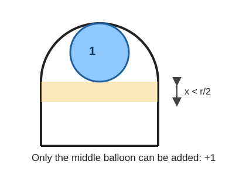
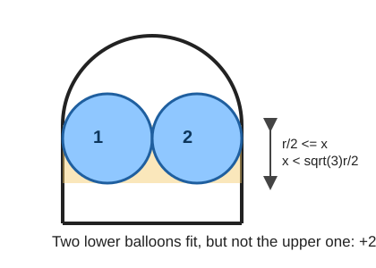
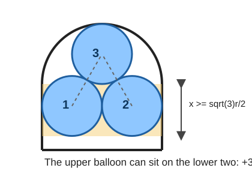

# C. Cupboard and Balloons

time limit per test: 2 seconds
memory limit per test: 256 megabytes

A girl named Xenia has a cupboard that looks like an arc from ahead. The arc is made of a semicircle with radius `r` (the cupboard's top) and two walls of height `h` (the cupboard's sides). The cupboard's depth is `r`, that is, it looks like a rectangle with base `r` and height `h + r` from the sides.

Xenia got lots of balloons for her birthday. The girl hates the mess, so she wants to store the balloons in the cupboard. Luckily, each balloon is a sphere with radius `r / 2`. Help Xenia calculate the maximum number of balloons she can put in her cupboard.

You can say that a balloon is in the cupboard if you can't see any part of the balloon on the left or right view. The balloons in the cupboard can touch each other. It is not allowed to squeeze the balloons or deform them in any way. You can assume that the cupboard's walls are negligibly thin.

## Input

The single line contains two integers `r`, `h` (`1 ≤ r, h ≤ 10^7`).

## Output

Print a single integer — the maximum number of balloons Xenia can put in the cupboard.

## Examples

**Input**

```text
1 1
```

**Output**

```text
3
```

**Input**

```text
1 2
```

**Output**

```text
5
```

**Input**

```text
2 1
```

**Output**

```text
2
```

## Summary

Look at the side view. Every balloon has radius `r / 2`, so its diameter is `r`.
In the rectangular part of height `h`, each full height segment of length `r`
can contain two balloons side by side. Therefore the base contribution is

```text
2 * floor(h / r)
```

Let `x = h mod r` be the remaining height above those full segments. Only the
top of the cupboard matters now.

- If `x < r / 2`, only one more balloon fits in the middle under the arc.
- If `r / 2 <= x < sqrt(3) * r / 2`, two more balloons fit.
- If `x >= sqrt(3) * r / 2`, three more balloons fit: two near the sides and
  one above them.

The three cases look like this after all full two-balloon layers have been
removed:







The second threshold comes from two touching balloons of radius `r / 2`: when
their centers are horizontally `r / 2` apart, the vertical distance needed for
the next touching center is `sqrt(r^2 - (r / 2)^2) = sqrt(3) * r / 2`.

The implementation avoids floating point:

```text
x < r / 2                 -> 2*x < r
x < sqrt(3) * r / 2       -> 4*x*x < 3*r*r
```

So the answer is:

```text
2 * (h / r) + one_of(1, 2, 3)
```

The algorithm uses `O(1)` time and `O(1)` memory.
